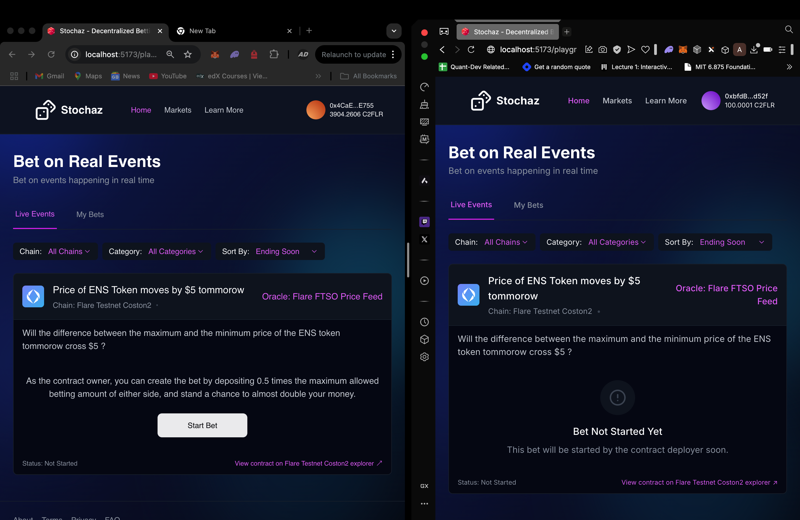

# Stochaz - Decentralized Betting Platform

## Watch the demo👇

<a href="https://www.youtube.com/watch?v=Mgb7fql2xmc" target="_blank">
  
</a>

## Overview

Stochaz is a decentralized betting platform built on the Flare Coston2 testnet that enables users to place bets on real-world events including:

- Stock price movements
- Cryptocurrency token price changes
- Weather fluctuations
- Sporting event outcomes
- Any measurable external data point

The platform leverages Flare Network's innovative oracle solutions:

- **Flare Time Series Oracle (FTSO)**: Provides reliable price feeds
- **Flare Data Connector (FDC)**: Securely accesses external data sources
- **Flare Random Number Generator**: Ensures fair distribution of rewards

## Technical Architecture


<div style="font-size: 1.5em;">

### Frontend Application

### Landing Page


#### Component Structure

The React frontend uses ThirdWeb SDK for blockchain interactions and features a state-responsive UI architecture:

1. **Event Cards**: Display active betting opportunities
2. **State-specific Components**:
   

- `BetNotStarted`: Pre-betting information -
  The owner of the contract sees a button to start the bet, and other users can only participate once the contract owner starts the bet.


- `BettingPeriodOngoing`: Core betting interface
  During this phase, users can access real-time aggregate betting statistics.


Users can also see their individual betting positions, and are able to place"For" and "Against" bets through the frontend, which serves as an interfaceto the underlying smart contract.


- `ObservationPeriodOngoing`: Display during result observation
  During this phase, users can view real-time betting statistics, monitor their own positions, and see a live countdown of the time remaining until the bet is resolved, while the system awaits final outcome determination.


- `BetBeingResolved`: Users can see a loader while the bet is being resolved


- `BetEnded`: Results and withdrawal options
  In this phase, users see the resolved outcome of the bet. Players on the winning side are presented with a "Withdraw Funds" option along with a congratulatory message.


Additionally, the randomly selected bonus winner (from the winning side) sees a special message indicating they’ve won the bonus and can withdraw their reward with the added bonus.


Players on the losing side see a "Better luck next time" message. All users can review final betting statistics and outcomes.

</div>

### Smart Contract Design

The core of Stochaz is a Solidity smart contract (`FlareBetting.sol`) deployed on the [Flare Coston2 testnet](https://coston2-explorer.flare.network/address/0x837B83ec2A8B857735Ffdf3c182BBF5893dB6d66).

#### State Machine Implementation

The contract implements a robust state machine with five distinct states:

```solidity
enum BetStatus {
    YetToBeStarted,
    BettingPeriodOngoing,
    ObservationPeriodOnGoing,
    BetBeingResolved,
    BetEnded
}
```

State transitions are secured through modifiers:

```solidity
modifier whileBettingPeriodOngoing() {
    require((s_isBetCreated == true) && (_betStatus == BetStatus.BettingPeriodOngoing),
            "The bet isn't running");
    _;
}

modifier whileObservationPeriodOngoing() {
    require((s_isBetCreated == true) && (_betStatus == BetStatus.ObservationPeriodOnGoing),
            "The bet isn't running");
    _;
}
```

#### Flare Network Integrations

**FTSO Integration**:

```solidity
function getFtsoV2CurrentFeedValues()
    public
    view
    returns (uint256 _feedValues, uint64 _timestamp)
{
    return ftsoV2.getFeedByIdInWei(bytes21(0x01464c522f55534400000000000000000000000000));
}
```

**FDC Integration**:

```javascript
const response = await axios.post(
  "https://jq-verifier-test.flare.rocks/JsonApi/prepareRequest",
  {
    attestationType:
      "0x494a736f6e417069000000000000000000000000000000000000000000000000",
    sourceId:
      "0x5745423200000000000000000000000000000000000000000000000000000000",
    requestBody: {
      url: coinGeckoUrl,
      postprocessJq: ".prices | map(.[1]) | max * 1000000 | floor",
      abi_signature: "value(uint256)",
    },
  },
  {
    headers: {
      "Content-Type": "application/json",
      X-API-KEY: "JQ_VERIFIER_API_KEY, // Add your API key or token here
    },
  }
);
```

**Random Number Generation**:

```solidity
function getSecureRandomNumber()
    public
    view
    returns (uint256 randomNumber, bool isSecure, uint256 timestamp)
{
    (randomNumber, isSecure, timestamp) = randomV2.getRandomNumber();
    require(isSecure, "Random number is not secure");
    return (randomNumber, isSecure, timestamp);
}
```

#### Bet Resolution Logic

The contract implements a sophisticated resolution mechanism:

```solidity
function resolveBetWithFDC(uint256 maxPriceInUSD, uint256 minPriceInUSD)
    external
    whileBetBeingResolved
    returns (bool isForSideWinner)
{
    // Compare against target
    bool conditionMet = (maxPriceInUSD - minPriceInUSD >= i_maximumSpreadInUSD);

    if(conditionMet) {
        // "For" side wins
        if(s_forBettersAddresses.length != 0) {
            // Pick random winner for bonus
            (uint256 randomNumber, , ) = getSecureRandomNumber();
            uint256 randomIndex = randomNumber % s_forBettersAddresses.length;
            address payable randomRewardWinner = s_forBettersAddresses[randomIndex];
            s_forBettersToAmountBetInUSD[randomRewardWinner] += s_randomRewardInUSD;
            emit randomWinnerPicked(randomRewardWinner);
        }

        // Distribute winnings to all "For" bettors
        for(uint256 i=0; i<s_forBettersAddresses.length; i++) {
            address payable winner = s_forBettersAddresses[i];
            uint256 amountToBePaid = s_forBettersToAmountBetInUSD[winner];
            s_forBettersToAmountBetInUSD[winner] += amountToBePaid/2;
        }

        // Reset "Against" bettors amounts
        for(uint256 i=0; i<s_againstBettersAddresses.length; i++) {
            address payable loser = s_againstBettersAddresses[i];
            s_againstBettersToAmountBetInUSD[loser] = 0;
        }

        emit winnersPicked(true);
        isForSideWinner = true;
    } else {
        // "Against" side wins - similar logic for against winners
        // ...
    }

    _betStatus = BetStatus.BetEnded;
    return isForSideWinner;
}
```

## Betting Mechanics

### Bet Creation

The contract owner must initialize a bet by providing liquidity to ensure solvency:

```solidity
function startBet() external payable onlyOwner {
    if(msg.value < (convertUSDtoFLRinWei(i_maximumBetFromEitherTeamInUSD)/2 +
                    convertUSDtoFLRinWei(s_randomRewardInUSD))) {
        revert Betting__sendMoreGasToStartBet();
    }
    s_betCreationTimeStamp = block.timestamp;
    s_isBetCreated = true;
    _betStatus = BetStatus.BettingPeriodOngoing;
}
```

### Bet Placement

Users can bet "For" or "Against" a specified event outcome:

```solidity
function betFor(uint256 amountToBetInUSD) external payable onlyAfterBetHasStarted whileBetIsBettingPeriodOngoing {
    require(s_amountBettedForInUSD + amountToBetInUSD <= i_maximumBetFromEitherTeamInUSD,
            "Maximum bet amounts have been accepted");
    require(msg.value >= convertUSDtoFLRinWei(amountToBetInUSD), "Send more");

    if(s_forBettersToAmountBetInUSD[msg.sender] == 0) {
        s_forBettersAddresses.push(payable(msg.sender));
    }
    s_forBettersToAmountBetInUSD[msg.sender] += amountToBetInUSD;
    s_amountBettedForInUSD += amountToBetInUSD;
}
```

### Payout Calculation

Winners receive 1.5x their bet amount:

- Original bet amount returned
- 50% profit on their bet
- One random winner receives a bonus reward from fees collected

### Withdrawal Process

After bet resolution, winners can withdraw their funds:

```solidity
function withdrawAmount(address payable user) external payable afterBetHasBeenResolved {
    if(s_forBettersToAmountBetInUSD[user] != 0) {
        (bool sent, ) = user.call{value: convertUSDtoFLRinWei(s_forBettersToAmountBetInUSD[user])}("");
        require(sent, "Transfer failed");
    }
    if(s_againstBettersToAmountBetInUSD[user] != 0) {
        (bool sent, ) = user.call{value: convertUSDtoFLRinWei(s_againstBettersToAmountBetInUSD[user])}("");
        require(sent, "Transfer failed");
    }
}
```

## Challenges Faced

### Smart Contract Automation

One of the primary challenges encountered during development was automating the state transitions of the betting contract. Currently, there is no native automation framework for Flare smart contracts, which created hurdles for automating critical time-based state changes:

- **Backend-Based Automation**: To overcome this limitation, we implemented a backend script that monitors event times and calls appropriate contract functions after predetermined durations.
- **State Transition Scheduling**: The backend script handles scheduling for transitioning from betting period to observation period, and then to resolution state.
- **Reliability Concerns**: This approach requires maintaining a constantly running server, introducing potential single points of failure.

Looking forward, when Flare Network integrates a dedicated automation framework similar to Chainlink Automation or Gelato Network, these challenges will be greatly simplified. Native automation will eliminate the need for external scripts, making the platform more decentralized, reliable, and easier to maintain. Time-based state transitions would be handled directly on-chain, ensuring precise timing without requiring centralized infrastructure.

### Modularity and Customization

Another significant challenge was balancing platform modularity with data reliability:

- **Limited Event Creation**: Currently, only the contract owner can create betting events, limiting the platform's scalability and user engagement.
- **Data Source Trust**: Allowing users to create their own betting events would require trusting them to provide correct API endpoints for data fetching, introducing potential manipulation risks.
- **Structural Improvements**: We identified opportunities to enhance the contract architecture using solidity structs like `BetEvents` to encapsulate betting event details.

A more modular approach would enable users to create and start custom betting events while allowing other users to participate in them. This would significantly scale the platform's offerings and engagement. We're exploring solutions that leverage Flare's oracle capabilities to validate external data sources without compromising security, possibly through a reputation system or a governance-based approach for approving new data sources.

## Technical Specifications

### Smart Contract Parameters

| Parameter                       | Description                                       |
| ------------------------------- | ------------------------------------------------- |
| `betFeesInUSD`                  | Fee collected for each bet                        |
| `betPlacingInterval`            | Duration of the betting period (in days)          |
| `maximumSpreadInUSD`            | Threshold price movement that defines bet outcome |
| `maximumBetFromEitherTeamInUSD` | Maximum total bet amount allowed per side         |
| `randomRewardInUSD`             | Bonus reward for one random winner                |

### Flare Network Integrations

#### FTSO (Flare Time Series Oracle)

Stochaz leverages FTSO v2 for:

- FLR/USD price feeds with block-latency updates (~1.8 seconds)
- Price conversion for bet amounts denominated in USD
- Decentralized data sourcing from ~100 independent providers
- Zero-cost queries for real-time data

#### Flare Random Number Generator

Provides cryptographically secure random numbers used for:

- Selection of random winner for bonus rewards
- Fair distribution of incentives
- Tamper-proof randomness source on-chain

#### Flare Data Connector (FDC)

- JSON API attestation with JQ transformations
- Verifiable data integration from external sources
- Secured data pathway for smart contract usage

### Security Considerations

- Owner deposits prevent contract insolvency
- State transition controls prevent timing attacks
- Secure random number generation ensures fair rewards
- Maximum bet limits prevent economic attacks

## Setup and Installation

### Prerequisites

- Node.js v16+
- npm or yarn
- Flare Coston2 testnet wallet with FLR tokens
- MetaMask or another Web3 wallet

### Contract Deployment

1. Clone the repository:

   ```bash
   git clone https://github.com/your-repo/stochaz.git
   ```

2. Install dependencies:

   ```bash
   npm install
   ```

### Frontend Setup

1. Navigate to the frontend directory:

   ```bash
   cd src
   ```

2. Install dependencies:

   ```bash
   npm install
   ```

3. Configure the application by updating the contract address in `src/client.ts`:

   ```javascript
   const contract = getContract({
     client: client,
     chain: defineChain(114), // Flare Coston2 chain ID
     address: "YOUR_DEPLOYED_CONTRACT_ADDRESS",
   });
   ```

4. Start the development server:
   ```bash
   npm run dev
   ```

## Operational Workflow

### Contract Owner Operations

1. **Deploy Contract**:

   - Set bet fees, betting period, observation period, and maximum spread
   - Set maximum bet amount limits

2. **Start Bet**:

   - Owner deposits initial liquidity
   - Activates betting period

3. **State Management**:
   - Transition from betting to observation period
   - Transition from observation to resolution
   - Provide external data for bet resolution

### User Operations

1. **Connect Wallet**:

   - Connect Web3 wallet to the platform
   - Ensure sufficient FLR tokens for betting

2. **Place Bets**:

   - Choose "For" or "Against" position
   - Specify bet amount (typically fixed at 2 USD equivalent)

3. **Monitor Status**:

   - Track bet progress through different states
   - View real-time betting statistics

4. **Claim Winnings**:
   - After bet resolution, winners can withdraw their funds
   - Check for possible bonus rewards

## Future Development

- **Multi-asset Betting**: Support for betting with various tokens
- **Custom Bet Creation**: Allow users to create custom betting events
- **Liquidity Pools**: Automated market-making for bet liquidity
- **Mobile Application**: Native mobile experience
- **Mainnet Deployment**: Migration from testnet to production environment

## License

MIT

## Contact

For questions or support, please open an issue on our GitHub repository.
